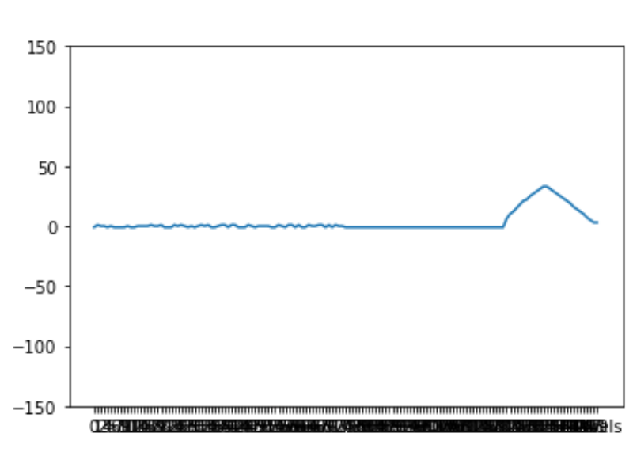

# Classification of User-specific Symbols for Intuitive Control Using CNN
**Marshall Johnson**  
**Northwestern MS in Robotics | Final Project**  
**Advisors: Matthew Elwin, PhD and Ola Kalinowska**  

## Overview
The primary objective of this project was to classify [sip-and-puff (SNP)](https://www.orin.com/access/sip_puff/#Sip/Puff%20Breeze) signals into user-defined symbols to generate an intuitive set of controls. The application of this technology would be particularly useful to someone who lacks the ability to use their hands. This project allows for the creation of a custom set of controls using an SNP sensor in a short amount of time. 

## Process
1. To begin, a user must complete a set of simulated mazes that can be viewed through RViz and/or Gazebo.   
*Note: Though the user feels as if they are in control of the robot, the robot control is predefined based on the maze generated. Future development would allow for the user to affect robot behavior as they progress through the maze curriculum.*
2. The inputs a user provides to complete this maze are collected to train a neural network sepcific to that user. The data is auto-labelled based on tags applied to sections of the maze during the generation process.
3. User data is augmented to increase the size of the dataset, reducing the need for a more time intensive data collection process with the user. 
4. The augmented dataset is used to train a 1-dimensional convolutional neural network (CNN) to classify SNP inputs into discrete movement actions (forward, left, right, stop).
5. Using the trained network, the user can navigate the Gazebo world freely, and eventually, real life.

## Contents

### Nodes
- `maze`: Responsible for generating maze in simulated Rviz/Gazebo environment. Subscribes to sip and puff input and auto-labels user data during simulation run. Can also be run without maze to speed up data collection process. 
- `data_collection`: Collects and publishes data from sip and puff sensor to be used by `maze` node.

### Python Library
- `cnn.py`: Neural network used to classify sip and puff signals (1D CNN)
- `data_augmentation.py`: Contains functions used to augment user data. Generates large dataset from small original sample to facilitate model training and reduce time required from user.
- `generate_maze.py`: Generates maze of variable difficulty from preset tiles. Creates path through maze for robot to follow.
- `synthetic.py`: Generate and test synthetic dataset. Primarily used to test/verify machine learning pipeline.

## Usage Instructions
### Simulation
Collect user sip and puff input while running maze simulation:  
1. `roslaunch maze_gen maze.launch`  
Launches a turtlebot in the simulated environment with `sim` as the control mode.
2. `rosservice call \generate_maze "difficulty:0"`    
Generates easy maze and creates markers in Rviz and Gazebo to display. To generate medium or hard maze, use `"difficulty:1"` or `"difficulty:2"`, respectively.
3. `rosservice call \move`  
Starts turtlebot in motion and initiates sip and puff data collection.
4. `rosservice call \process_data`  
Process sip and puff data for csv output.
5. `rosservice call \save_data`  
Save processed data as csv.

### Data Collection Only
Collect data from sip and puff without running maze simulation:  
1. `roslaunch maze_gen maze.launch`  
Launch simulated environment (Control mode does not matter. Can also be run with `control:=manual`)  
2. `rosservice call \collect_data`  
Will save the latest sip and puff input received and prompt for ground truth value. Input ground truth with keyboard and press Enter.   
*Note: Make sure to sip/puff into sensor prior to this step.*
3. `rosservice call \save_data`  
Save labeled data to csv.  

### Testing Trained Model
Use trained model to move turtlebot through maze simulation:  
1. Ensure path to desired model is correct in the `load_model` function of the `maze` node.
2. `roslaunch maze_gen maze.launch control:=manual`  
Launches a turtlebot in the simulated environment with `manual` as the control mode.  
3. `rosservice call \generate_maze`  
Generates maze and creates markers in Rviz and Gazebo to display.  
4. Provide sip and puff input. Model will make predictions and translate into corresponding movement actions represented by the turtlebot in simulation. 

### Optional Services
- `rosservice call \print_data`  
Prints data collected along with labels.
- `rosservice call \reset`  
Resets simulation and data to run another trial.  
- `rosservice call \toggle_control_mode`  
Toggles control mode between `sim` and `manual`. Running this service will switch to whichever control mode is not currently being used.

## The Model
This project uses a 1-dimensional convolutional neural network (1D CNN) to classify user inputs into movement actions: forward, left, right, and stop. For each user, a new model is trained to make predictions specific to that user. The 1D CNN is trained on actual data collected from the user, as well as augmented data derived from the initial SNP input signals.  

## Data Augmentation Process
The data augmentation process randomly applied transformations to the real data collected from a user until the desired number of data points was achieved. For this project, that number was 20,000 (starting from 20 original samples; 5 from each class).

1. Center &mdash; Separates noise and signal and centers signal in time. This first step was applied to each data point. 
2. Apply one of the following:  
    - Compress &mdash; Compresses signal and adds noise in its place.
    - Expand &mdash; Expands signal by taking mean of consecutive data.
    - Shift Left/Right &mdash; Shifts signal either earlier or later in time.

## Examples & Demonstrations
### Mazes
The maze generation algorithm developed through this project is able to create a maze of easy, medium, or hard difficulty. The mazes draw from a subset of tiles that allow for increasingly more freedom of movement. For example, easy difficulty is contrained to right-angle turns and straight movements, whereas medium difficulty introduces diagonal movements.  

Easy                    |  Medium            | Hard                  
:-------------------------:|:-------------------------:|:-------------------------:
 |   | 

### Trials & Results
This section highlights both the data collection and testing processes. After collecting sip and puff data from a user, the data was augmented and a model was trained. Using the trained model, the user was required to navigate a maze similar to the one used for data collection (also randomly generated). This time, however, their input was fed into the model and classified as one of the four movement actions (stop, start, left turn, right turn). Having control over the turtlebot, the user was asked to complete the maze. Results of these trials are discussed below.

#### Data Collection
Below are demonstrations of the data collection process using a randomly generated maze of easy difficulty. The chart overlays shown in the videos represent the input the user is providing through the SNP sensor.

https://user-images.githubusercontent.com/36053672/187091322-4467145b-485f-4245-af63-16712cfb4bf7.mp4

https://user-images.githubusercontent.com/36053672/187097198-6cf444bb-74fa-43b1-acd8-52b191bb6c48.mp4

#### Live Testing
This video shows a user navigating a maze using their own set of symbols created through the data collection and model training phases. In this trial, the model achieved 100% accuracy. Overall, the accuracy for this user was 91% (See User 1 below).

https://user-images.githubusercontent.com/36053672/187346802-bc4e7d72-888a-478c-be0d-d74c1dd77136.mp4

After collecting data using the process demonstrated above, a model was trained and tested live. As an example, a graphical representation of one set of symbols created by each user is shown below, along with results and qualitative commentary from the trials. Accuracy was determined by comparing user's intended action and the actual movement of the robot resulting from the model's prediction.

Movement Action | User 1 | User 2 | User 3 | User 4 | User 5                
:---------------|:-------|:-------|:-------|:-------|:-------
Stop |  |  |  |  | 
Start |  |  |  |  | 
Left Turn |  |  |  |  | 
Right Turn |  |  |  |  | 
Results | Successfully navigated maze with minimal error.   **Overall, model predicted correct movement actions with 91% accuracy.** | Successfully navigated maze with minimal error. Right Turn was misclassified occasionally.   **Overall, model predicted correct movement actions with 83% accuracy.** | Successfully navigated maze with minimal error. Occasionally, Forward would be misclassified as Stop.   **Overall, model predicted correct movement actions with 87% accuracy.** | Successfully navigated maze with almost no error. Stop was misclassified as Left Turn, but rarely.   **Overall, model predicted correct movement actions with 95% accuracy.** | Successfully navigated maze with minimal error. Stop was misclassified as Left Turn occasionally.   **Overall, model predicted correct movement actions with 87% accuracy.**

Users 1-4 were profiles created by the author to test the robustness of the pipeline. User 5 was not the author and was given no instructions other than to use the sip and puff device to guide the robot through the simulated maze. In both cases, the data augmentation process outlined above was used to generate more data. In every trial, the trained model was able to successfully predict movement actions from sip and puff inputs; the user was able to easily navigate a maze using their custom set of symbols.

## Next Steps
- Easy difficulty was the only one tested during this project. Further testing is needed to confirm pipeline is working for medium and hard difficulties.  
- Add contextual information (e.g., point cloud data) to allow user more flexibility with symbol creation. E.g., an input is given in advance in a hallway, but the robot waits for the next opening to turn.  
- Create dynamic maze curriculum that allows user to differentiate between similar symbols. Mazes designed to differentiate between similar symbols will be auto-generated until clear distinction is achieved.

